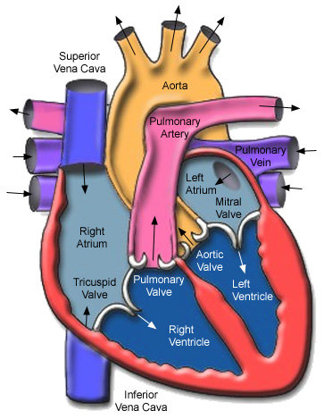
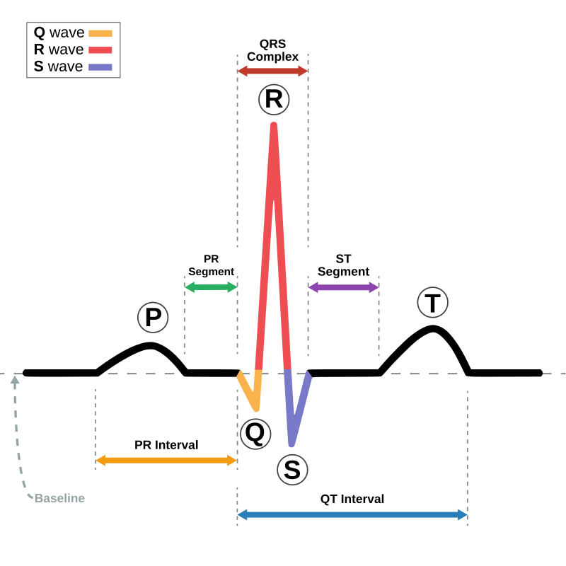
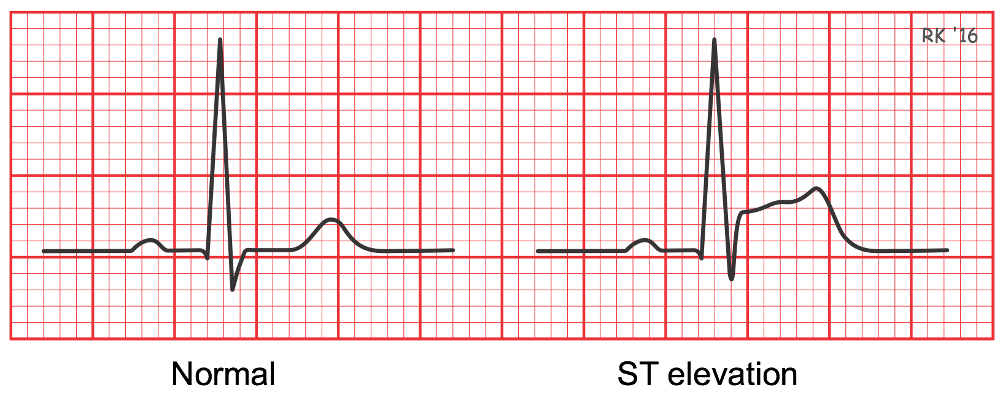
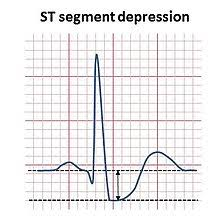
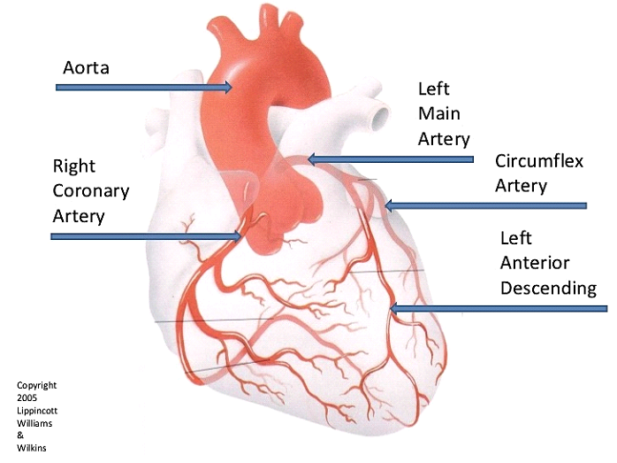
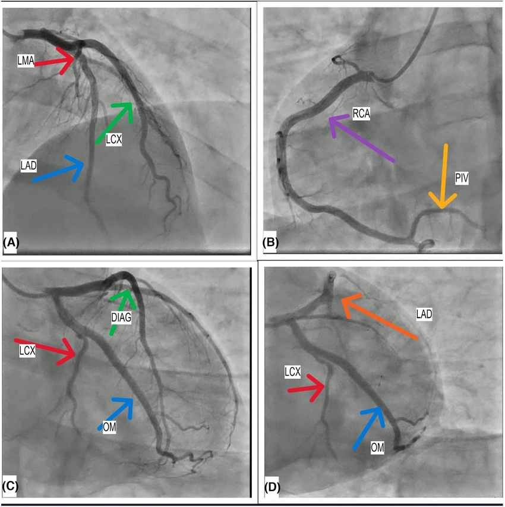
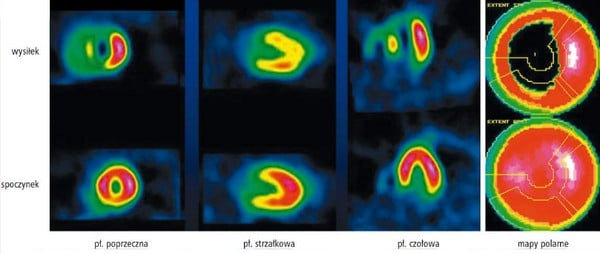

# Feature Descriptions (Concise & Feature-Focused) for Heart Disease Dataset

This document provides brief, feature-focused descriptions for each variable in the heart disease dataset. It emphasizes what each feature *is* and its typical values, without directly stating disease implications.

---

## Feature: id

**Description:** Unique Patient Identifier.

**Type:**  Nominal (Categorical, unique).

**Values:**  Unique numerical from 1 to 920.

---

## Feature: age

**Description:** Patient's Age.

**Type:** Numerical (Continuous).

**Values:**  From 28 to 77.

**Short explaination**:
Likelyhood of coronary artery disease increases with age, especially for patients over 70 [1].

---

## Feature: dataset

**Description:** Study Location.

**Type:** Categorical (Nominal).

**Values:**

Represents the study site where the data was collected.

*   `1`: Cleveland
*   `2`: Hungarian
*   `3`: V.A. Long Beach
*   `4`: Switzerland

---

## Feature: sex

**Description:** Patient's Biological Sex.

**Type:** Categorical (Binary).

**Values:**
*   `0`: Female
*   `1`: Male

**Short explaination:**
Men are statistically ~2-5 times more likely to develop coronary heart disease than women of similar age​, women's risk increases after menopause [2].

---

## Feature: cp (Chest Pain Type)

**Description:** Type of Chest Pain.

**Type:** Categorical (Nominal/Ordinal - ordered categories in terms of severity of angina).

**Values:**

Describes the nature of chest discomfort experienced - reported by patients.

*   `0`: typical angina -  Pain typical of classic angina.
*   `1`: atypical angina - Angina with some atypical characteristics.
*   `2`: non-anginal - Chest pain not related to angina.
*   `3`: asymptomatic - No chest pain reported.

**Short explaination:** 
- Typical angina - (Most common for coronary heart disease) Chest feels tight, dull or heavy, usually while physical exertion or experiencing stress. Pain usually goes away while resting [1].

- Atypical angina - (Less common) stinging, burning, tearing or spilling, it may be located also on a back. It does not have to be associated with physical exertion, it can occur at rest, sometimes it doesn't goes away after medicine [1].

---

## Feature: trestbps (Resting Blood Pressure)

**Description:** Resting Blood Pressure.

**Type:** Numerical (Continuous).

**Values:**  mm Hg (millimeters of mercury). Typical range from 80 to 200 mm Hg.

**Short explaination:**
Resting blood pressure (only the systolic blood pressure - force of blood pressing on the walls of arteries during heart contraction), measured upon admission to the hospital (patient without physical exertion 5 min prior). High-level values ≥140 mmHg ​​may indicate hypertension - which is one of the major risk factor for heart disease​ [3].

---

## Feature: chol (Serum Cholesterol)

**Description:** Serum Cholesterol Level.

**Type:** Numerical (Continuous).

**Values:** mg/dl (milligrams per deciliter). Typical range from 85 to 600 mg/dl.

**Short explaination:** 
High cholesterol levels promote the formation of atherosclerotic plaques (Miażdżyca), which narrow the arteries and restrict blood flow. A high value is considered to be >240 mg/dl (200–239 mg/dl borderline high). Very high values: >300 mg/dl [1].

---

## Feature: fbs (Fasting Blood Sugar)

**Description:** Fasting Blood Sugar Level Status.

**Type:** Categorical (Binary).

**Values:**

Indicates if fasting blood sugar exceeds a threshold.

*   `0`: Fasting blood sugar ≤ 120 mg/dl
*   `1`: Fasting blood sugar > 120 mg/dl

**Short explaination:**
Blood glucose level after at least 8 hours of fasting (no food or drink except water). Fasting glucose ( glucose level over >120 mg/dl) may indicate hyperglycemia or diabetes. Value 1 supervisory hyperglycemia or control. Diabetes is a strong threat to heart disease - the risk of death from heart disease in diabetics is significantly higher than normal person [4].

---

## Feature: restecg (Resting Electrocardiographic Results)

**Description:** Resting ECG Results.

**Type:** Categorical (Nominal).

**Values:**
*   `0`: normal - Normal ECG reading.
*   `1`: st-t abnormality - ST-T wave abnormality detected.
*   `2`: lv hypertrophy - Left ventricular hypertrophy detected.

**Short explaination:**
0=normal, 1 = ST-T abnormality (e.g. ST depression or elevation > 0.05 mV, negative T waves, etc.), 2 = left ventricular hypertrophy confirmed by Estes criteria. For example, ST-T changes at rest suggest ischemia or post-infarction scarring (after heart attack), while left ventricular hypertrophy often results from long-term hypertension – both cases are associated with a higher risk of cardiac events compared to a completely normal ECG. A value of 1 or 2 (presence of ECG abnormalities) may indicate the existence of heart disease. ST- fragment of ECG comes from repolarization of muscle, when there is for e.g elevation of ST fragment it means that there are dead cells in left ventricule or the left ventricle is bigger that it should be (flow of charge from right ventricule is not balanced enough by flow of charge from left ventricle).

---

## Feature: thalach (Maximum Heart Rate Achieved)

**Description:** Maximum Heart Rate During Exercise.

**Type:** Numerical (Continuous).

**Values:** bpm (beats per minute). Typical range from 60 to 220 bpm.

**Short explaination:**
The maximum achieved heart rate during exercise. This value reflects the heart's ability to work faster under load; lower values ​​may be due to limitations due to age, physical condition, heart disease or heart disease related pain. Lower peak heart rate values ​​may indicate so-called chronotropic inability (the heart cannot reach a high enough rate), patients with heart disease often have lower maximum heart rates [5].

---

## Feature: exang (Exercise-Induced Angina)

**Description:** Exercise-Induced Angina.

**Type:** Categorical (Binary).

**Values:**

Indicates presence of chest pain triggered by physical exertion.

*   `0`: No - Angina not induced by exercise.
*   `1`: Yes - Angina induced by exercise.

**Short expaination:**
Indicates whether symptoms of chest pain occurred during exercise. The occurrence of pain during exercise is a signal of myocardial ischemia during load, which strongly suggests the presence of significant coronary artery stenoses.

---

## Feature: oldpeak (ST Depression Induced by Exercise)

**Description:** ST Depression During Exercise.

**Type:** Numerical (Continuous).

**Values:**  mm (millimeters, measured on Electrocardiographic Results). Typical range from 0.0 to 6.0 mm.

ST depression induced by exercise relative to rest.

**Short descripion:**
The amount of ST segment depression on an exercise ECG relative to the isoelectric line at rest (*restecg*). It measures ischemia-induced ST segment depression during exercise (1.0 corresponds to 1 mm of ST depression).A higher oldpeak value means a greater ST depression, which indicates more severe myocardial ischemia during exercise. A depression of ≥1 mm (oldpeak ≥ 1.0) is considered a positive, abnormal stress test result – a strong prognostic factor for coronary artery disease [6].

---

## Feature: slope (Slope of Peak Exercise ST Segment)

**Description:** Slope of Exercise ST Segment.

**Type:** Categorical (Ordinal).

**Values:**

Describes the shape of the ST segment during peak exercise on the ECG.

*   `0`: downsloping
*   `1`: flat
*   `2`: upsloping

**Short explaination**
Measured in physical activity tests, this shape provides information about the nature of ischemic changes: upsloping – ST depression with an upward slope (considered the least specific, can also occur in healthy people), flat – horizontal ST depression (more abnormal), downsloping – ST depression with a downward slope (most abnormal). In particular, ST downslope on exertion is strongly associated with ischemia, considered pathological and strongly prognostic for coronary artery disease.

---

## Feature: ca (Number of Major Vessels Colored by Fluoroscopy)

**Description:** Number of Major Vessels Narrowed.

**Type:** Numerical (Discrete).

**Values:** Counts from 0 to 3. Represents the count of major coronary arteries showing significant narrowing as visualized by fluoroscopy.

**Short explaination:**
Angiography consists of inserting iodine-based contrast (which makes fluorescence effect in X-ray radiation) to the patient's blood, we get a X-picture of the distribution of contrast in the arteries. For healthy, unnarrowed arteries there is an even distribution of contrast, uneven distribution is indicative of narrowed arteries (e.g. displayed below).
Higher ca values ​​indicate the involvement of many vessels multi-vessel disease. The more coronary arteries with stenoses, the more extensive the disease and the greater the risk of serious events.

---

## Feature: thal (Thallium Stress Test Result)

**Description:** Thallium Stress Test Result.

**Type:** Categorical (Nominal).

**Values:**

Categorizes the outcome of a thallium stress test assessing blood flow to the heart.

*   `0`: normal - Normal thallium scan.
*   `1`: fixed defect - Fixed defect observed.
*   `2`: reversible defect - Reversible defect observed.

**Short explaination:**
In thallium scintillation, the patient is given a radioactive isotope of thallium into the blood, then the patient performs physical exercise. Thallium behaves like potassium, which is needed for proper depolarization of cells (leading to contraction of the heart muscle). For this reason, thallium accumulates in healthy cells, in ischemic or dead areas it is deposited in smaller amounts or not at all. Later heart area is recorded by a camera recording gamma radiation (the thallium isotope is radioactive - it causes the emission of gamma radiation). Fixed defect corresponds to area which are irreversibly defected (for e.g scar from a heart attack). Reversible defect corresponds to areas which comes back to normal after resting (indicates live but ischemic heart muscles during exertion).

---

## Feature: y (Target Feature)

**Description:**  Heart Disease Diagnosis.

**Type:** Categorical (Multiclass).

**Values:**

Indicates the presence or absence, and level of heart disease as diagnosed.

*   `0`: No heart disease.
*   `1`, `2`, `3`, `4`: Stages of heart disease.

**Short explaination:**
0 = no disease (narrowing < 50% in any major artery), 1,2,3,4 = presence of heart disease (various degrees – the number corresponds to, among others, the number of vessels > 50% narrowed or different locations). It is most important to distinguish the absence of disease from any disease state (1, 2, 3, 4).

---

---
## Citing:

[1] - *CHUN, Andrea Akita; MCGEE, Steven R. Bedside diagnosis of coronary artery disease: a systematic review. The American journal of medicine, 2004, 117.5: 334-343.*

[2] - *JOUSILAHTI, Pekka, et al. Sex, age, cardiovascular risk factors, and coronary heart disease: a prospective follow-up study of 14 786 middle-aged men and women in Finland. Circulation, 1999, 99.9: 1165-1172.*

[3] - *Fryar CD, Chen T-C, Li X. Prevalence of uncontrolled risk factors for cardiovascular disease: United States, 1999–2010. NCHS Data Brief. 2012;(103):1–8.*

[4] - *https://www.cdc.gov/diabetes/php/data-research/index.html*

[5] - *Lauer MS, Francis GS, Okin PM, Pashkow FJ, Snader CE, Marwick TH. Impaired chronotropic response to exercise stress testing as a predictor of mortality. JAMA. 1999 Feb 10;281(6):524-9. doi: 10.1001/jama.281.6.524. PMID: 10022108.*

[6] - *RYWIK, Tomasz M., et al. Role of nondiagnostic exercise-induced ST-segment abnormalities in predicting future coronary events in asymptomatic volunteers. Circulation, 2002, 106.22: 2787-2792.*

---
